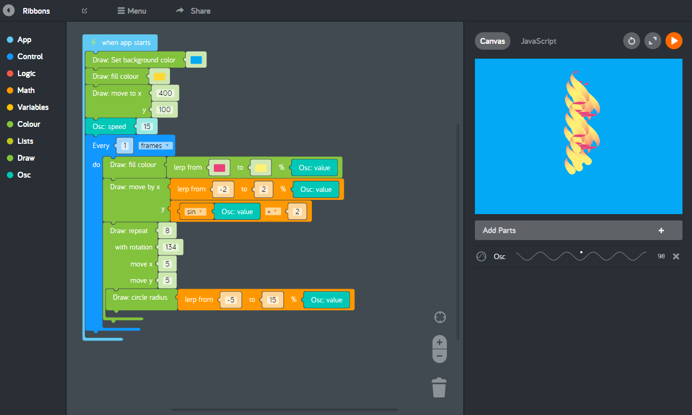

# Kano Code

## The Repository

This repository `kano-code` is where we (Kano) develop Kano Code, our user friendly creative coding editor. This source code is available for everyone under the standard GPLv2 license.

## Kano Code



Kano Code is part of [Kano World](https://world.kano.me) and our [apps](https://kano.me/app)

## Contributing

There are many ways in which you can participate in the project, for example:

 - [Submit bugs and feature requests](https://github.com/KanoComputing/kano-code/issues), and help us verify as they are checked in
 - Review [source code changes](https://github.com/KanoComputing/kano-code/pulls)
 - Review the [guides](https://github.com/KanoComputing/kano-code/tree/master/guides) and make pull requests for anything from typos to new content

If you are interested in fixing issues and contributing directly to the code base, please see the document [How to Setup](./SETUP.md)

## Usage

```js
import { Editor } from '@kano/code/index.js';

const editor = new Editor({ sourceType: 'blockly' });

editor.inject(document.body);

```

## License

Copyright (C) 2019 Kano Computing Ltd.

License: http://www.gnu.org/licenses/gpl-2.0.txt GNU General Public License v2

