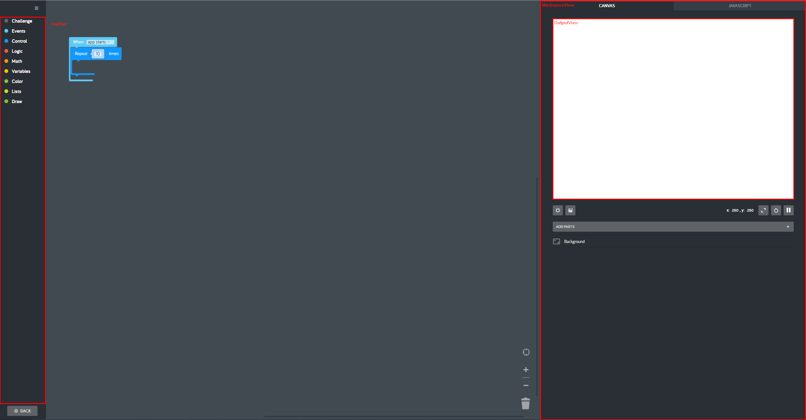
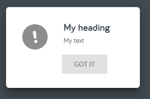
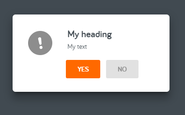

# Editor



## Toolbox

The toolbox while being provided through the EditorProfile, can be updated at runtime using a plugin. The toolbox can be accessed through `editor.toolbox`

### API

 - `addEntry(entry, position)`:
    Adds an entry to the toolbox at the provided index or at the end. Will return a disposable object.
```js
// Add the entry
const entry = toolbox.addEntry({ type: 'module', name: 'my-entry' });

// Dispose of the entry
entry.dispose();
```
 - `removeEntry(entry)`:
    Remove an entry
```js
const mod = { type: 'module', name: 'my-entry' };
// Add the entry
toolbox.addEntry(mod);

// Remove the entry
toolbox.removeEntry(mod);

```

## Dialogs

The Editor allows you to register your custom alert/confirm/dialogs.
Each dialog will have `fitInto` and `overlayInto` property, accepting a DOM element on top of which you want the dialog to fit

### Alert

Used to display a simple information on screen, No interaction or choice is required from the user
except that they closes this dialog.



```js
const alert = editor.dialogs.registerAlert({
    heading: 'My heading',
    text: 'My text',
    buttonLabel: 'Got it',
});

alert.open(); // Opens the alert
alert.close();
alert.on('close', () => {
    alert.dispose();
});
```

### Confirm

Used to ask the user a yes/no question. The dialog displays custom text, a confirm and a dismiss
action.


```js
const alert = editor.dialogs.registerConfirm({
    heading: 'My heading',
    text: 'My text',
    confirmLabel: 'Yes',
    dismissLabel: 'No',
});

alert.open(); // Opens the alert
alert.close();
// These two will be called before `onClose`
alert.on('confirm', () => {});
alert.on('dismiss', () => {});
alert.on('close', () => {});
alert.dispose();
```

### Dialogs

Used to display custom content in a dialog. The inside of the dialog is for you to fill

```js
import * as code from '@kano/code/app/lib/index.js';

class MyDialogProvider extends code.DialogProvider {
    createDom() {
        const root = document.createElement('div');
        root.innerHTML = `
            <h1>My dialog</h1>
            <p>My custom content</p>
        `;
        return root;
    }
}

const alert = editor.dialogs.registerDialogProvider(new MyDialogProvider());

alert.open(); // Opens the alert
alert.close();
alert.on('close', () => {});
alert.dispose();
```

### KeyBindings

Used to register shortcuts in the editor.

```js

const altPBinding = editor.keybindings.register('alt+p', () => {});

altPBinding.dispose();

```