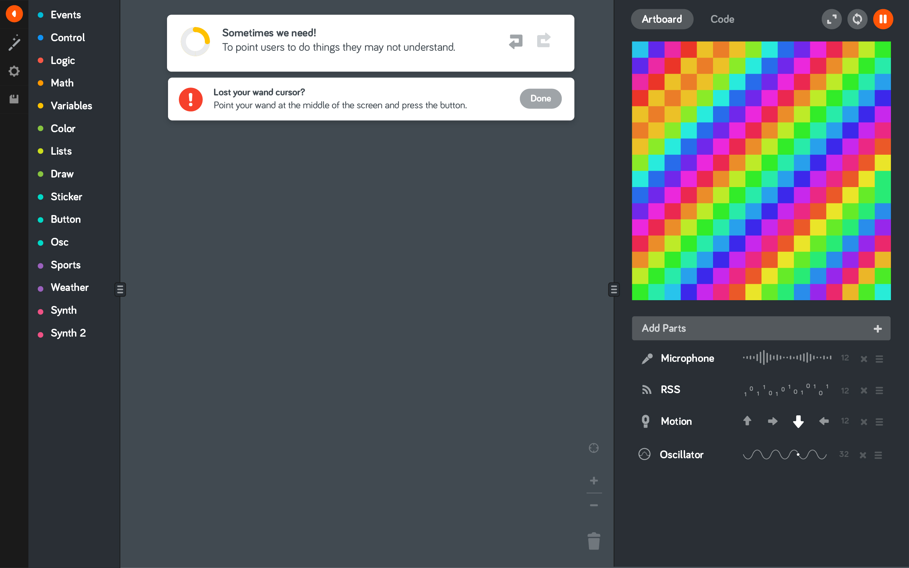

# Banner API

Provides a way to display a banner in the `sourceEditor`.
If multiple banners are opened at the same time, it will stack them up.

The editor controls the implementation of the banners. You customise the content, but the positioning is managed by the editor.
As the editor can have different `sourceEditor`s implementations, each one will have a different way to display banners

Im plementation design for the Blockly `sourceEditor`: 



Simple banner with text and icon:

```js
class MyBannerProvider extends code.BannerProvider {
    get options() {
        return {
            icon: '/assets/icons/info.svg',
            heading: 'Something happened?',
            text: 'Something just happened, here\'s some info about it',
            buttonLabel: 'Ok',
        };
    }
}

const banner = editor.banner.register(new MyBannerProvider());

// Will fit the banner in the sourceEditor, and open it
banner.open();
// Closes the banner
banner.close();

// Deletes the banner
banner.dispose();

```

Banner with custom content

```js
class MyBannerProvider extends code.BannerProvider {
    constructor() {
        super();
        this.dom = document.createElement('div');
        this.dom.innerHTML = `
            
            <p>Custom banner content</p>
            <button></button>
        `;
    }
    get root() {
        return this.dom;
    }
}

editor.banner.register(new MyBannerProvider());

banner.open();
banner.close();
banner.dispose();
```