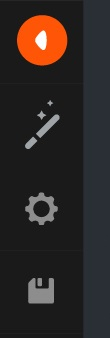

# Activity bar API

The Activity Bar is the bar sitting on the left of the editor:

Design Implementation:



Provides a way to add items to the Activity Bar.

```js
const activityBarEntry = editor.activityBar.registerEntry({
    title: 'Hello',
    icon: '/assets/icons/info.svg',
    disabled: false,
});

// Triggered on click/touch
activityBarEntry.on('activate', () => {});

// Update the disabled status of the entry
activityBarEntry.disable();
activityBarEntry.enable();

// Remove the entry
activityBarEntry.dispose();
```